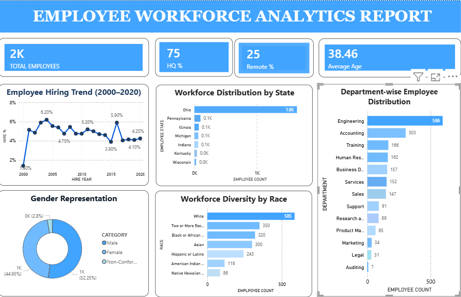

 HR Analytics Dashboard -- Power BI

## 📊 Project Overview

This project is an HR Analytics dashboard developed using Microsoft
Power BI to analyze employee workforce data and provide useful business
insights.

The dashboard focuses on workforce composition, hiring trends, employee
demographics, work location, department distribution, and workforce
diversity.

## 🎯 Project Objectives

-   Analyze the total employee workforce.
-   Compare HQ and remote employees.
-   Calculate average employee age.
-   Analyze employee hiring trends over time.
-   Understand gender representation.
-   Analyze workforce distribution by state.
-   Analyze employee distribution across departments.
-   Examine workforce diversity by race.
-   Present key findings through an interactive Power BI dashboard.

## 🛠️ Tools & Technologies

-   Microsoft Power BI
-   DAX
-   Data visualization
-   Data analysis
-   Microsoft Word
-   Microsoft PowerPoint

## 📈 Dashboard KPIs

The final dashboard includes:

-   Total Employees
-   HQ %
-   Remote %
-   Average Age

## 📊 Dashboard Visualizations

The dashboard contains:

1.  Employee Hiring Trend (2000--2020)
2.  Workforce Distribution by State
3.  Department-wise Employee Distribution
4.  Gender Representation
5.  Workforce Diversity by Race

## 📁 Project Structure

``` text
HR-Analytics-PowerBI/
│
├── dashboard/
│   └── HR_Analytics_Dashboard.pbix
│
├── documentation/
│   ├── PRDA-03 KPI analysis report.docx
│   └── Project_Requirements.docx
│
├── presentation/
│   └── HR analytics presentation.pptx
│
├── screenshots/
│   ├── department_employee_distribution.png
│   ├── employee_hiring_trend.png
│   ├── gender_representation.png
│   ├── workforce_distribution_by_state.png
│   └── workforce_diversity_by_race.png
│
└── README.md
```

## 💡 Key Insights

The dashboard helps identify:

-   Changes in hiring activity across different years.
-   The balance between HQ and remote employees.
-   Differences in employee representation across genders.
-   Departments with larger employee populations.
-   Geographic concentration of the workforce.
-   Workforce diversity across different racial groups.

## 📷 Dashboard Preview


Screenshots of the individual Power BI visualizations are included in
the `screenshots` folder.
The repository includes screenshots of the individual Power BI visualizations.

The complete Power BI dashboard is available in `HR_Analytics_Dashboard.pbix`.

The project documentation is available in `HR_Analytics_Project_Report.docx` and `HR_Analytics_Project_Requirements.docx`.

The PowerPoint presentation is available in `HR_Analytics_Presentation.pptx`.

The complete Power BI dashboard is available in the `dashboard` folder.

## 📚 Documentation

The `documentation` folder contains the project report and the original
project requirements/tasks.

## 🎤 Presentation

The `presentation` folder contains the PowerPoint presentation used to
explain the project and its findings.

## 👤 Author

** Mallela mohammad Barkat**

Data Analytics \| Power BI \| SQL \| Excel
